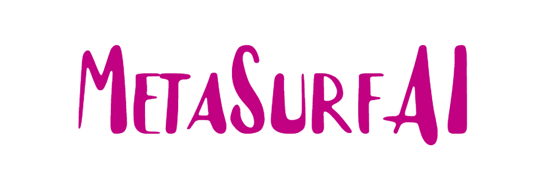

# 🪙 Decentralized Advertisement Platform 🚀

## Overview

The project is about a webapplication that will serve as a largest decentralized advertisement platform in the world 🛠 

### Front-End

The Front-End is a single-page application (SPA) developed using modern technologies to ensure a seamless user experience. 📱

**Features:**

* User-friendly interface for exploring and interacting with advertisements. 👀
* Integration of blockchain technology for secure transactions. 🔒
* Real-time statistics and insights on advertisements. 📈

**Tech Stack:**

* React.js: Building dynamic and responsive user interfaces. 💯
* Next.js: Server-side rendering for enhanced performance. 🚀
* Web3.js: Interacting with blockchain networks. 🔐

### Back-End

The Back-End showcases my proficiency in building and maintaining the core functionalities of a decentralized platform. 🔨

**Key Functions:**

* Cryptocurrency exchange for seamless transactions. 💰
* Comprehensive tracking and reporting of advertisement statistics. 📊
* RESTful API design for efficient communication. 📡

**Tech Stack:**

* Go (Golang) + Rust: Distributed High-performance server-side programming. ⚡️
* PostgreSQL + Redis: Database management for storing advertisement data. 💾
* Kafka : Message Queue. 📢
* REST API + gRPC: Implementing secure and efficient communication. 🔒
* Docker + Kubernetes: Containerization for streamlined deployment. 🚢

 
  
  
    
     
   
   
  
  
   
  
   
  
   
   
  
    

## Domain Pattern

## Getting Started

As this project is currently private, please reach out to me directly for access to the repository. I would be delighted to provide an in-depth walkthrough and discuss the tech stack and architecture in further detail. 💡

## Contribution Guidelines

While the project is currently private, I am open to collaboration and future contributions. Feel free to connect with me to discuss potential involvement or explore similar projects. 🤝

## Contact

If you have any questions or would like to learn more, please don't hesitate to reach out:

* LinkedIn: [@Md Shahadat Hossen Nayem](https://www.linkedin.com/in/shnartho/) 👨‍💻
* LinkedIn: [@Jemal Samba](https://www.linkedin.com/in/jemal-samba-a2a671241/) 👨‍💻

#### ©️ Co-Founder: ©️Md Shahadat Hossen Nayem ©️Jemal Samba
